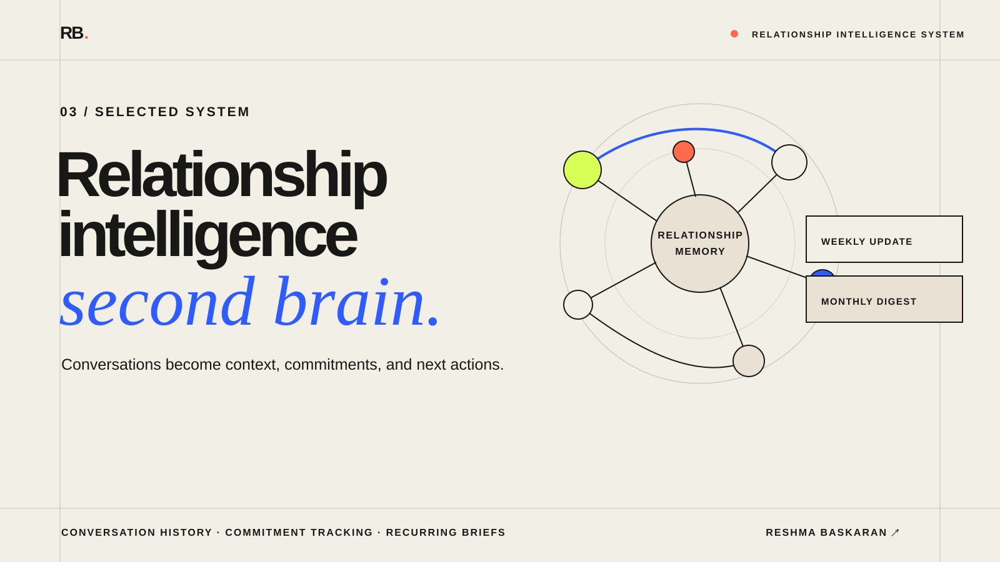

# Relationship Intelligence Second Brain



An Obsidian-compatible, connector-neutral starter kit for turning client,
partner, analyst, vendor, and other strategic conversations into durable
relationship history, commitments, interests, and recurring operating briefs.

This is a reusable framework—not a hosted app and not a populated personal
vault. Fork it, create a private vault from the blank template, and connect
your own permitted notes.

## What the system turns into memory

| Input | Durable output |
|---|---|
| Permitted meeting note or public source | Immutable source record with stable ID and content hash |
| Attributed stakeholder interest | Searchable interest register with evidence context |
| Direct commitment | Owner, due date, source and open/closed state |
| Maintained themes and recent activity | Monthly relationship digest with source links |

```text
source → history → interests → commitments → recurring brief
```

Public research remains `research_only`. Private notes can use local provenance,
and simulations are excluded from production metrics by default.

## The problem

Meeting summaries are easy to accumulate and hard to use. Important asks disappear between documents, relationship context stays with one person, follow-ups lose owners, and monthly reporting becomes a manual reconstruction exercise.

This system separates immutable sources from maintained knowledge, then turns that knowledge into an interaction ledger, stakeholder-interest register, weekly updates, and monthly digests.

## What is included

- A 15-minute [quickstart](QUICKSTART.md) and local configuration example.
- A blank Obsidian vault scaffold created by `scripts/init_vault.py`.
- A reusable Codex skill for relationship-intelligence ingestion.
- A source and wiki architecture for Obsidian.
- Stakeholder, source, theme, and commitment templates.
- A structural vault linter.
- Evidence-context and privacy linting that keeps public research separate
  from direct relationship history.
- Machine-enforced production, simulation, and test-fixture modes so QA data
  never inflates live relationship metrics.
- HTTPS provenance for public material and stable local provenance for private
  permitted notes.
- A transactional local-source ingest command with stable IDs, content hashes,
  duplicate detection, dry runs, and rollback.
- A monthly digest that reads direct interactions, public/research sources,
  stakeholder interests, and commitments while retaining source links.
- The transactional contract used by the live meeting-note ingest.
- Privacy boundaries for public and external use.

## What a fork gives you

After following the quickstart, you have the folders, registers, templates,
validation rules, and scripts needed to start building your own relationship
intelligence vault. Your notes remain outside this public repository.

It does not include a ready-made relationship history, fictional account data,
connector credentials, or automatic Granola, Gmail, Slack, or CRM ingestion.
Those integrations belong in your private workflow.

## Architecture

See [docs/architecture.md](docs/architecture.md) and the [meeting-note ingest contract](docs/granola-ingest-contract.md).

The system maintains five operating layers:

```text
raw sources
  → source summaries
  → organizations, stakeholders, themes, claims, commitments
  → interaction and interest registers
  → weekly updates and monthly digests
```

## Relationship outputs

- What changed in recent conversations?
- What does each stakeholder demonstrably care about?
- What did we commit to, who owns it, and when is it due?
- What material should we read or share next?
- Which relationships have unresolved timing, proof, or attribution risk?
- What should the next month of engagement prioritize?

The system originated in my analyst-relations work and is presented here as a broader client-and-partner relationship model.

## Run the tools

Create a blank vault outside this repository first:

```bash
python3 scripts/init_vault.py --config relationship-intelligence.config.json
```

Lint a vault:

```bash
python scripts/lint_vault.py /path/to/vault
```

Ingest one permitted local source:

```bash
python scripts/ingest_source.py \
  --vault /path/to/vault \
  --source-file /path/to/source.md \
  --title "Source title" \
  --summary "One source-bounded sentence" \
  --source-url https://example.com/source \
  --date 2026-08-07 \
  --source-type company_announcement \
  --evidence-context public_statement \
  --relationship-status research_only \
  --privacy public \
  --attribution confirmed \
  --organization "Example Company"
```

For a permitted private direct note with no public URL, use
`--source-ref local://meeting-exports/STABLE_ID` instead of inventing a URL.

Generate a monthly digest from the whole vault:

```bash
python scripts/generate_relationship_digest.py \
  /path/to/vault \
  --period 2026-07 \
  --out /path/to/vault/05_Outputs/2026-07-relationship-digest.md
```

Production digests exclude simulation and test fixtures. Add
`--include-simulation` only when you want a separate QA section.

## Privacy model

This repository contains the engine, schema, and templates—not my private vault. It excludes transcripts, stakeholder histories, licensed reports, contact information, commercial terms, connector credentials, and private automation state.

## Inspiration and extension

Andrej Karpathy described a useful pattern: immutable raw sources, an LLM-maintained wiki, a schema, and ingest/query/lint operations. My working system applies that pattern to relationship operations and adds interaction history, attributed interests, commitments, health, automation state, and recurring weekly/monthly synthesis. See [Karpathy's original gist](https://gist.github.com/karpathy/442a6bf555914893e9891c11519de94f).

## Current status

This public extraction is based on an active Obsidian system with recurring
meeting-note ingestion and monthly relationship reporting. The public code is
connector-neutral and includes local-source ingestion; private data,
credentials, and automation state remain local.

## Author

Built by **Reshma Baskaran**, a GTM and growth marketer building practical research, outbound, and knowledge systems.
