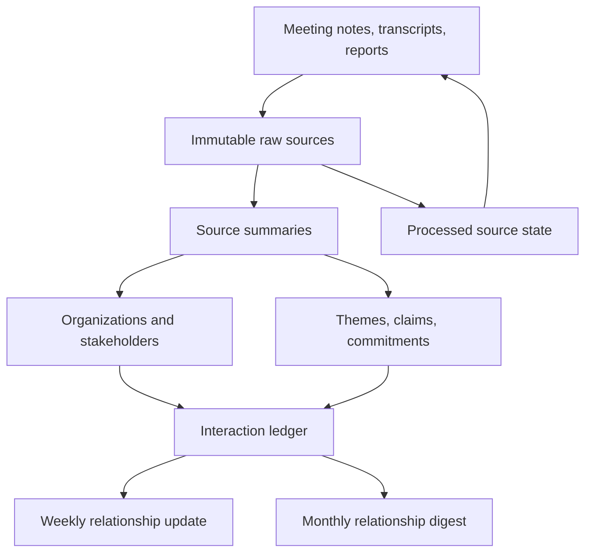

# Architecture

The raw-source layer is evidence. The wiki is maintained synthesis. Registers turn prose into operating data. Outputs are generated from those maintained layers and retain source links.

